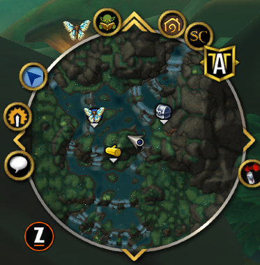

# MothBane



In Harandar, Glowing Moth treasures share the same minimap sparkle as lots of other treasures. That makes it easy to waste time chasing the wrong dot—or miss what you actually wanted. **MothBane** keeps those moths readable by swapping Blizzard’s usual treasure ping for something you choose: a clear **shadow** overlay or a dedicated **moth** icon.

Lightweight, **no dependencies**, World of Warcraft **Retail**.

---

## Why use this?

- Spot moth treasures **without** confusing them with unrelated treasures on the minimap.
- Pick the visual that fits how you navigate the zone—shadow or moth icon.
- Toggle everything off anytime with **Enable MothBane** or **`/mothbane off`** if you want vanilla behaviour back.

---

## Features

- **Two minimap styles** – Replace the default treasure vignette with a **shadow** tint or your **moth** artwork so moths stand out from other treasure pins.
- **Adjustable icon scale** – Small / Medium / Large so the overlay matches your minimap setup.
- **Minimap launcher** – Optional button on the minimap (hide it and use **`/mothbane`** only if you prefer a clean rim).
- **In-game settings** – Enable/disable, style, scale, and minimap button visibility from one panel.

---

## Slash commands

```
/mothbane              Open or close the settings window (handy when the minimap button is hidden).
/mothbane on           Enable MothBane (same as /mothbane 1).
/mothbane off          Disable MothBane (same as /mothbane 0).
```

---

## Opening the UI

- **Minimap:** Left-click the moth icon for options. **Right-click and drag** to move the icon.
- **Slash:** Type **`/mothbane`** to toggle the settings window.

---

## Settings

- **Enable MothBane** – Master on/off for all minimap behaviour.
- **Show minimap button** – Shows or hides the moth launcher on the minimap rim.
- **Replace Blizzard treasure with** – **Shadow** or **Moth** over each Glowing Moth on the minimap; default is **Moth**.
- **Icon scale** – **Small**, **Medium**, or **Large** overlay size.

---

## Installation

1. Download the latest zip from [CurseForge](https://www.curseforge.com/wow/addons/mothbane) or clone this repo.
2. Extract so the **`MothBane`** folder (with `MothBane.toc`, `MothBane.lua`, etc.) sits inside  
   `World of Warcraft\_retail_\Interface\AddOns\`.
3. Restart WoW or run **`/reload`**.

---

## Bugs & suggestions

Use **CurseForge comments** or **[GitHub Issues](https://github.com/flexxall/MothBane/issues)**—either works.

---

## Publishing & source

Release packaging and Git workflow: [CURSEFORGE.md](CURSEFORGE.md). **CurseForge overview:** use [CURSEFORGE_DESCRIPTION.html](CURSEFORGE_DESCRIPTION.html) for WYSIWYG (HTML/source paste) or [CURSEFORGE_DESCRIPTION.bbcode](CURSEFORGE_DESCRIPTION.bbcode) for BBCode—Markdown from this README often breaks on the site. Source: [github.com/flexxall/MothBane](https://github.com/flexxall/MothBane).
